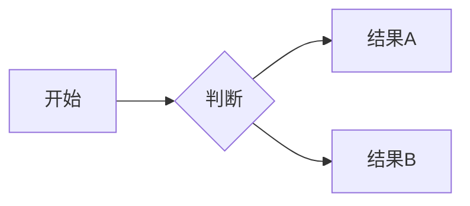
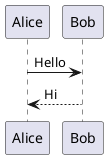

# MD2WeChat

Markdown 转微信公众号排版工具。左侧编辑 Markdown，右侧实时预览，一键复制到公众号编辑器。

## 功能特性

- **代码高亮** — 基于 highlight.js，支持 100+ 语言，浅色/深色代码主题切换
- **数学公式** — 基于 KaTeX，支持 `$...$` 行内公式和 `$$...$$` 块级公式
- **Mermaid 图表** — 流程图、序列图、甘特图、类图等
- **PlantUML 图表** — 支持 UML 各类图表，通过 PlantUML 服务器渲染
- **Infographic 信息图** — 基于 AntV Infographic 的声明式信息图
- **8 套预设主题** — 默认蓝、优雅紫、清新绿、暖阳橙、水墨黑、少女粉、科技蓝、极简白
- **自定义主题** — 颜色选择器自由调配
- **表格美化** — 自动斑马纹、圆角边框
- **脚注支持** — `[^1]` 引用 + `[^1]: ...` 定义
- **任务列表** — GFM `- [x]` / `- [ ]` 语法
- **Ruby 注音** — `[文字]{注音}` 或 `[文字]^(注音)`
- **一键导出** — 复制富文本直接粘贴到公众号编辑器，或下载 HTML 文件
- **草稿自动保存** — localStorage 持久化，刷新不丢失
- **编辑器工具栏** — 标题、加粗、斜体、链接、图片、代码块、表格等快捷按钮
- **快捷键** — Cmd+B 加粗、Cmd+I 斜体、Cmd+K 链接、Cmd+Shift+C 复制到公众号
- **分栏拖拽** — 自由调整编辑器和预览区宽度

## 快速开始

```bash
# 安装依赖
npm install

# 开发模式
npm run dev

# 生产构建
npm run build

# 预览构建产物
npm run preview
```

## 技术栈

| 类别 | 技术 |
|------|------|
| 构建工具 | Vite 8 |
| 语言 | TypeScript |
| Markdown 解析 | marked |
| 代码高亮 | highlight.js |
| 数学公式 | KaTeX |
| 流程图 | Mermaid |
| UML 图表 | PlantUML (服务端渲染) |
| 信息图 | AntV Infographic |

## 使用方法

### 基本编辑

在左侧编辑器输入 Markdown，右侧实时预览公众号排版效果。

### 图表支持

**Mermaid 流程图：**

````

````

**PlantUML 图表：**

````

````

**Infographic 信息图：**

````
```infographic
infographic list-row-simple-horizontal-arrow
data
  lists
    - label Step 1
      desc Start
    - label Step 2
      desc In Progress
    - label Step 3
      desc Complete
```
````

### 数学公式

行内公式：`$E = mc^2$`

块级公式：

```
$$
\int_{-\infty}^{+\infty} e^{-x^2}\, dx = \sqrt{\pi}
$$
```

### 导出

- 点击「复制到公众号」按钮或按 `Cmd+Shift+C`，直接粘贴到公众号编辑器
- 点击「查看 HTML」查看生成的 HTML 源码
- 点击「导出 HTML」下载完整的 HTML 文件

## 项目结构

```
src/
├── main.ts       # 入口，初始化各模块
├── render.ts     # Markdown 解析、扩展、图表渲染
├── editor.ts     # 编辑器逻辑、工具栏、快捷键
├── export.ts     # 微信导出、内联样式引擎
├── themes.ts     # 主题系统（8 预设 + 自定义）
├── ui.ts         # UI 组件（Toast、Resizer）
└── styles.css    # 全局样式
```

## 部署

```bash
npm run build
```

构建产物在 `dist/` 目录，可直接部署到任意静态服务器（Nginx、Vercel、GitHub Pages 等）。

## License

MIT
